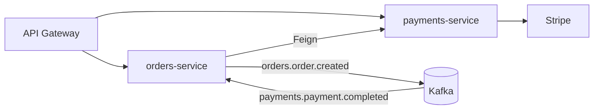

# Components (C4 Level 2–3)

> Template — one section per microservice. Keep each entry short; deep details belong in that
> service's own docs.

## Service Inventory

<!-- TODO: replace with your real data — the rows below are a fictional example -->
| Service | Owns (data) | Exposes | Consumes | Publishes (topics) | Subscribes (topics) |
| --- | --- | --- | --- | --- | --- |
| `orders-service` | orders, order_items, outbox_event | REST `/v1/orders` | `payments-service` (Feign) | `orders.order.created` | `payments.payment.completed` |
| `payments-service` | payments | REST `/v1/payments` | Stripe (external) | `payments.payment.completed` | `orders.order.created` |

## Per-Service Template

### `<service-name>`

- **Responsibility** — one sentence.
- **Data owned** — tables/aggregates. No other service touches these directly
  (`ai/ARCHITECTURE.md`).
- **APIs** — link to `docs/api/`.
- **Messaging** — topics produced/consumed; link to `docs/messaging/kafka-topics.md`.
- **Notable decisions** — link relevant ADRs.

## Component Diagram

<!-- TODO: replace with your real data — the diagram below is a fictional example -->

