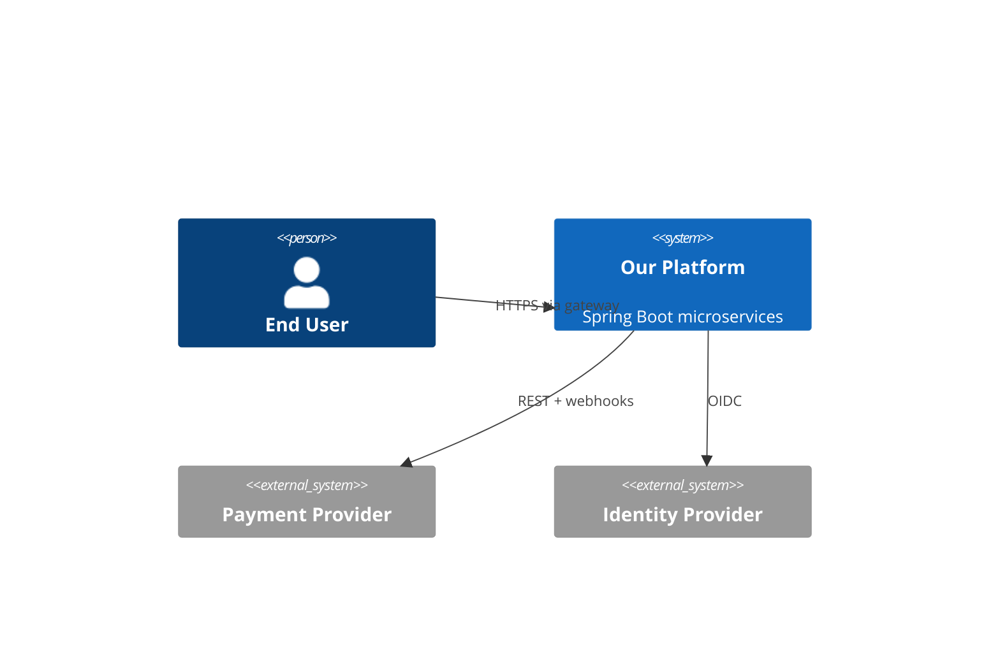

# System Context (C4 Level 1)

> Template — replace the placeholders with your platform's real actors and systems. Keep this at the
> "who talks to the system and why" level; components go in `components.md`.

## Purpose

One paragraph: what this platform does and for whom.

## Actors & External Systems

<!-- TODO: replace with your real data — the rows below are a fictional example -->
| Actor / System | Type | Interaction |
| --- | --- | --- |
| End user (web/mobile) | Person | Uses the product via the public API gateway |
| Partner X | External system | Calls partner API / receives webhooks |
| Payment provider (e.g. Stripe) | External system | Charges, refunds, webhooks — treated as an *external* error source per `docs/api/error-catalog.md` |
| Identity provider | External system | AuthN for users and services |

## Context Diagram

<!-- TODO: replace with your real data — the diagram below is a fictional example -->

## Trust Boundaries

Note where the public internet ends, where the mesh begins, and which calls cross a partner boundary
— this drives the internal-vs-external error split used across the codebase.
