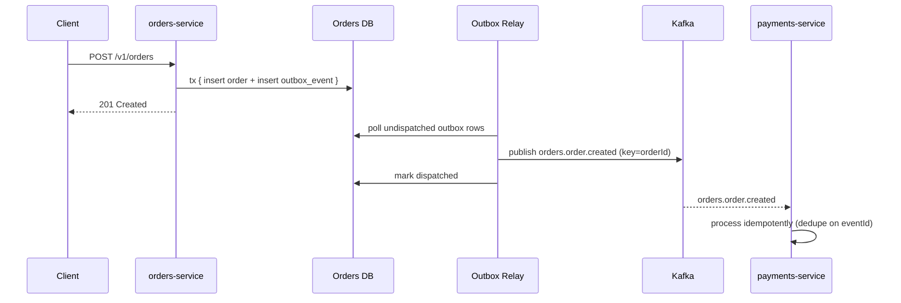

# Sequence Diagrams

> Template — one diagram per business-critical flow. Add a diagram whenever a flow crosses more than
> two services or involves the outbox/saga machinery; those are the flows nobody can hold in their
> head from code alone.

## Example: Order Creation (with outbox)

<!-- TODO: replace with your real data — the flow below is a fictional example -->

## Flows to Document Here

- [ ] Order creation / fulfillment saga (with compensations — see `ai/patterns/saga-pattern.md`)
- [ ] Payment webhook handling (external → internal boundary)
- [ ] The DLQ replay path (`docs/messaging/dlq.md`)
